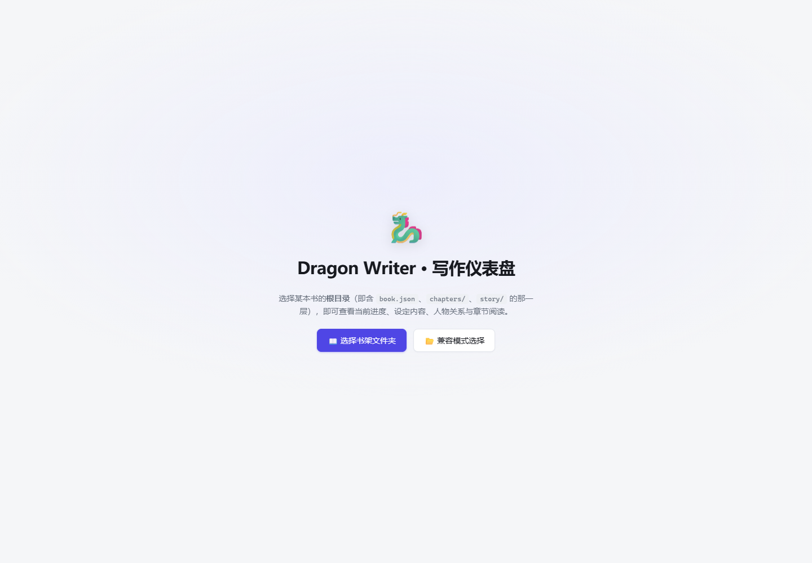
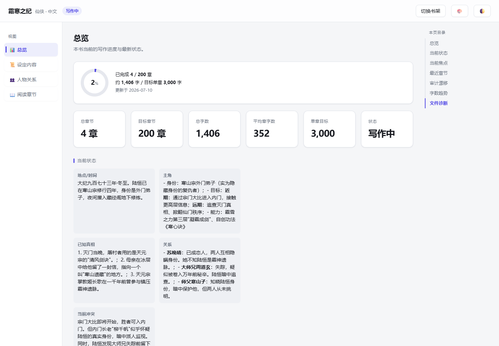
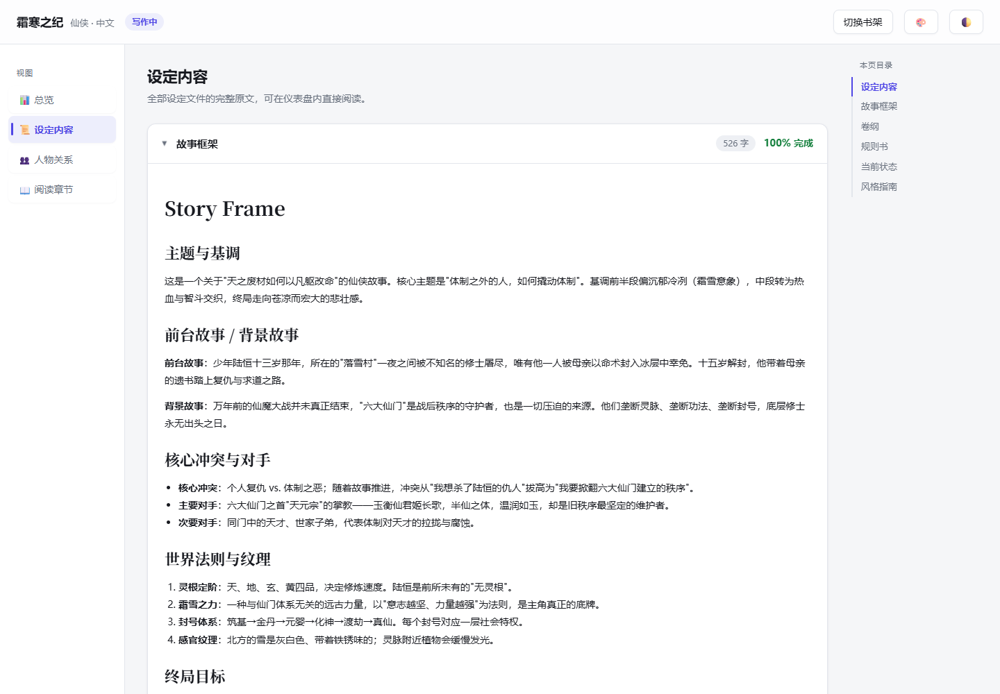
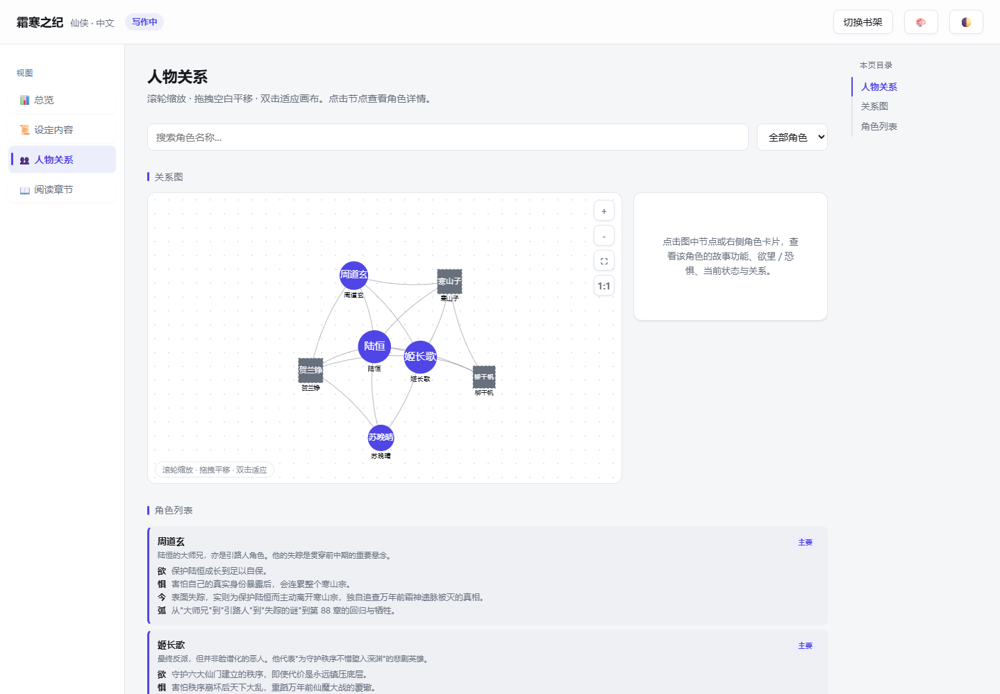
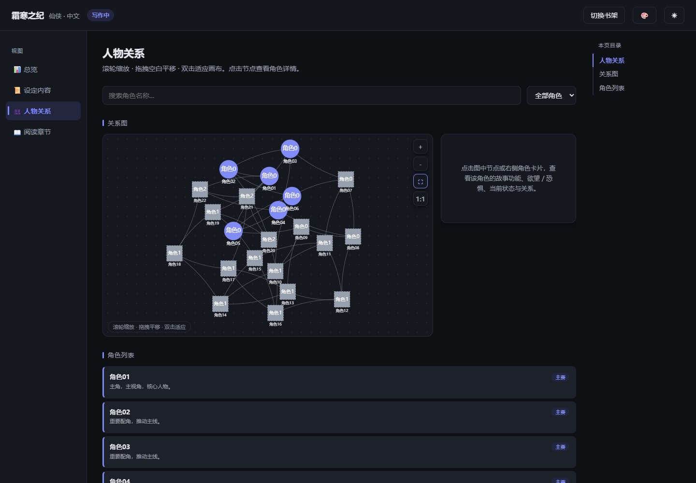
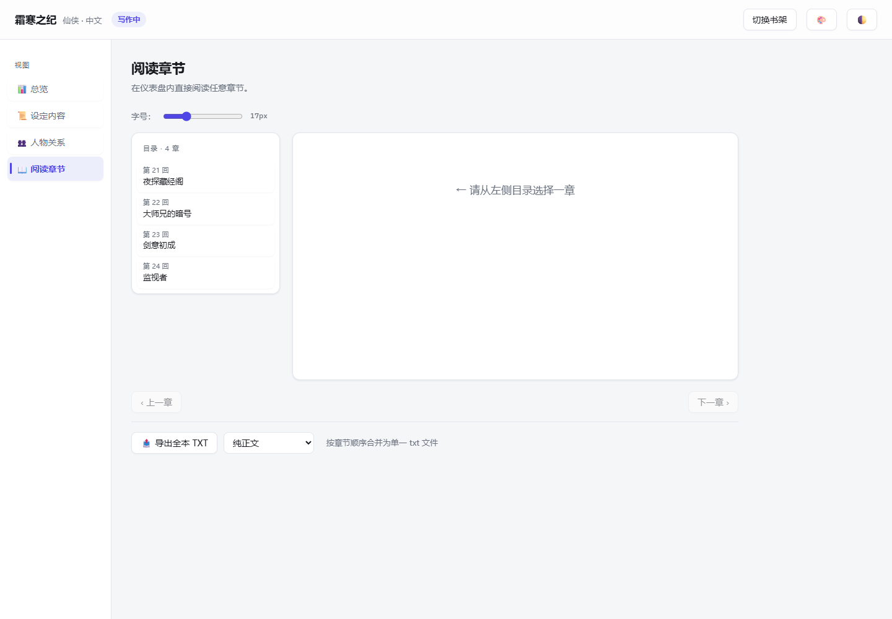
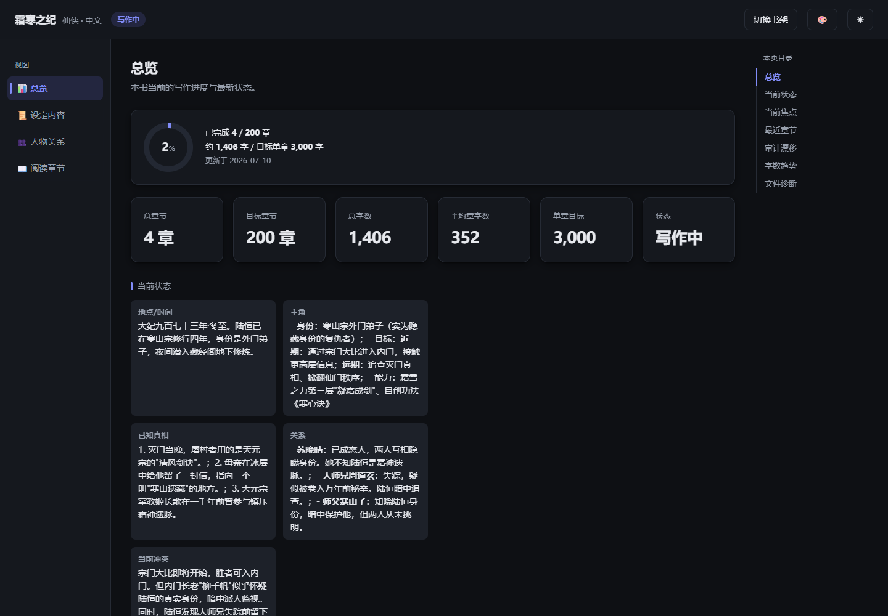

# Dragon Writer 🐉

一套**工具无关**（tool-neutral）的**长篇虚构小说写作工作流**，兼容各类 AI 编码 agent 使用。

把一部长篇拆成一份**可审计、可回滚、跨会话续写**的"文件圣经"，外加一份给作者自己看的**实时进度仪表盘**。**全程不靠记忆，靠文件。**



## 仓库结构

```
dragon-writer/                 # 仓库根（本文件所在层）
  books/                       # 所有书籍作品（每本书一个文件夹）
    <book-id>/
      book.json                # 书籍元数据
      chapters/                # 章节正文
      story/                   # 故事圣经（框架/卷纲/规则/状态/角色/钩子…）
  dragon-writer/               # Skill 本体（工作流 + 脚本 + 仪表盘模板）
    SKILL.md                   # 路由器：触发范围 + 核心规则 + 模式路由
    assets/dashboard.html      # 写作仪表盘（双击即用，零嵌入数据）
    scripts/                   # init / validate / snapshot / rollback / build…
    references/                # 文件契约 + 模板 + 43 维审计
    tests/                     # Python 契约测试 + Dashboard JS 测试
  screenshots/                 # 仪表盘截图（本 README 引用）
```

详细文档见 [dragon-writer/README.md](dragon-writer/README.md)。

## 写作仪表盘

`dragon-writer/assets/dashboard.html` 是一份**运行时模板**，不嵌入任何数据。双击打开后选择书根目录（含 `book.json`、`chapters/`、`story/` 的那一层），运行时读取源文件实时计算，永远反映最新内容。推荐 **Chrome / Edge**（File System Access API；Safari / Firefox 自动走兼容模式）。

四个标签页：

### ① 总览

进度环（带过渡动画）、6 张统计卡、当前状态、当前焦点、最近章节、审计漂移（已修复绿 / 已知漂移黄）、字数趋势柱状图、文件诊断。



### ② 设定内容

5 份设定文件（故事框架 / 卷纲 / 规则书 / 当前状态 / 风格指南）各一张可折叠卡片，Markdown 全文渲染，卡片标注字数与完成度。



### ③ 人物关系

Canvas 力导向关系图 + 角色列表：

- **滚轮缩放**（以光标为中心，0.25–3 倍）、**拖拽空白平移**、**双击适应画布**，右上角 ＋/－/⛶/1:1 视图控制
- 主要角色圆形实心、次要角色方形虚边（不依赖颜色区分）；主要内圈、次要外圈的初始布局
- 悬停 / 点击高亮该角色及其直接关系，其余淡出；右侧详情栏与画布等高，展示故事功能、欲望 / 恐惧、当前状态、弧线、秘密与全部关系
- 边标签药丸底 + 碰撞检测，角色再多也不互相覆盖；缩小时自动隐藏次要角色名字与边标签
- 下方角色卡区分主配：主要角色靛蓝色条 +「主要」徽章，次要角色灰色徽章；支持搜索与层级筛选



多角色场景（22 角色压力测试）：



### ④ 阅读章节

竖向目录（当前章高亮）、衬线字体正文渲染、字号滑杆、章内搜索（Ctrl+F，高亮 + 计数 + 跳转）、上一章 / 下一章导航、全本 TXT 导出（纯正文 / 保留 Markdown）。



### 深色模式

右上角按钮在 自动 / 浅色 / 深色 之间循环，选择记入 localStorage，关系图随主题实时重绘。



## 5+1 种工作流模式

| 模式 | 触发时机 | 做什么 |
| --- | --- | --- |
| **A · 新书** | 一句灵感 / 书名 / 题材 | 建目录、一口气产出全部基础文件骨架 |
| **B · 续写** | 书已存在 | 读工作集 → 起草 → 双层质量门禁（10 项初筛 + 43 维深化审计）→ 落盘 |
| **C · 导入** | 有旧章节，缺状态文件 | 从旧章反推基础文件，回放导入，续写 |
| **D · 转向** | "换方向 / 下一章写 X" | 轻量调 `current_focus.md`，不改整份大纲 |
| **E · 改写 / 修复** | 重写某一章 | 恢复快照 → 清后续产物 → 重写 → 再走质检 |
| **F · 仪表盘** | 看进度 / 关系 / 读章节 | 双击 HTML 打开，权限有效时自动重连 |
| **G · 合并审核** | 写完一章 / 多章后 | 合并选定章节统一跑 43 维审计，留痕审计漂移 |

## 快速开始

```bash
# 创建一本新书
python dragon-writer/scripts/init_book.py

# 打开仪表盘（进入某一本书，双击 dashboard.html）
start books/<book-id>/dashboard.html       # Windows
open   books/<book-id>/dashboard.html      # macOS
```

## 开发与测试

```bash
# 构建 self-contained dashboard（内联契约 + 质量检查）
python dragon-writer/scripts/build_dashboard.py

# 静态质量检查（语法 / no-undef / CSP / 大小）
python dragon-writer/scripts/quality_check.py

# Dashboard 单元 / 集成测试
node dragon-writer/tests/js/test_dashboard.js
node dragon-writer/tests/js/test_integration.js

# Python 全套测试（契约 + 账本一致性检查 + 自动更新）
python -m pytest dragon-writer/tests/ -q
```

落盘后运行 `python dragon-writer/scripts/validate_book.py <book-dir>` 做**账本一致性校验**：别名/角色双卡、wordCount 真值、事实表证据引文、道具 origin 漂移、canon 数字锚点、性别称谓、维度列一致性、book.json 生命周期——机器检查把正文/账本矛盾拦在产出环节。详见 [dragon-writer/README.md](dragon-writer/README.md)。

## 许可证

MIT License — 自由使用、修改、分发，需保留原始许可声明。
